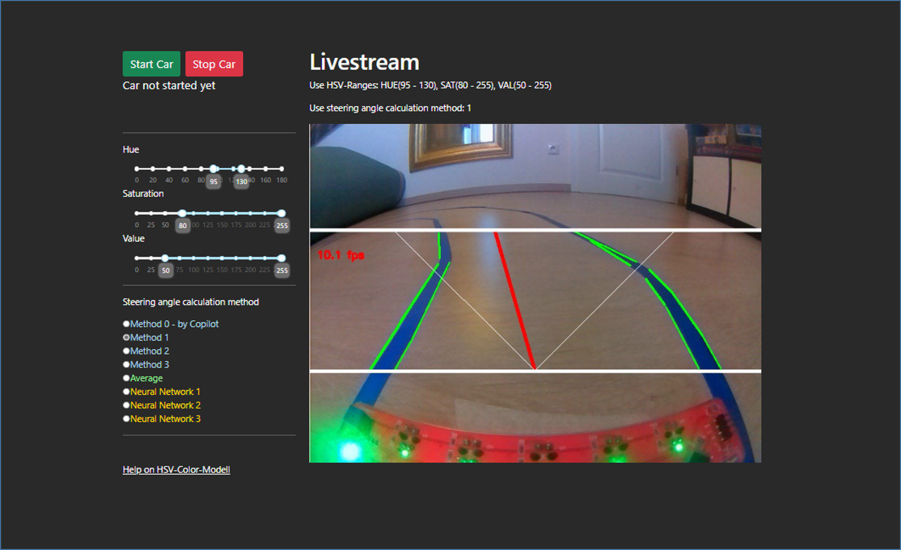
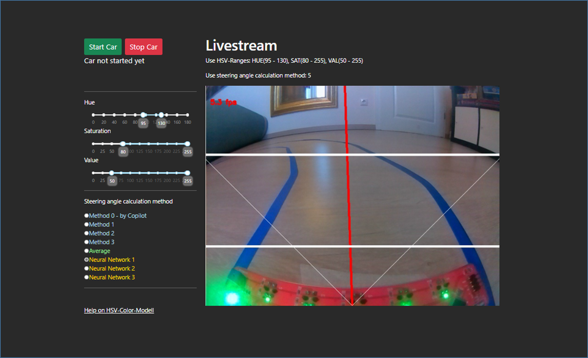
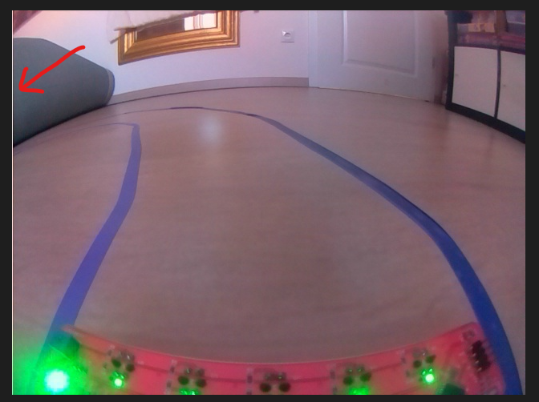

<center>

# Zusammenfassung Camp2Code Gen8 - Projektphase 2 - Gruppe 3

</center>

<center>


</center>

---

<!--- ################################ -->
<!--- ################################ -->
<!--- ################################ -->

<details close>

<summary>

# Dash-Frontend

</summary>






</details>

<details close>

<summary>

# Lenkwinkel

</summary>


<!--- ################################ -->
<!--- ################################ -->
<!--- ################################ -->


<details close>

<summary>

## Umsetzungsschritte
---
</summary>

* Implementierung der Klasse ```CamCar``` zur Nutzung der Kamera
* Visualiserung des Kamerabildes über Dash
* Entwicklung der Klasse ```OpenCVCar```
    * Fahrspurverfolgung durch bildverarbeitende Methoden mit OpenCV
* Umsetzung einer Lenkwinkel-Berechnung

</details>

<details close>

<summary>

## Erkennung der blauen Fahrspur-Begrenzung
---
</summary>

```python
# Bild beschneiden
img_crop = img[150:350,:,:]

# Parkettfugen verwischen
img_blur = cv2.blur(img_crop,(9, 9))

# In HSV-Farbraum konvertieren
img_hsv = cv2.cvtColor(img_blur, cv2.COLOR_BGR2HSV)

# Limits der HSV-Filter setzen
lower_blue = np.array([self.lower_hue, self.lower_saturation, self.lower_value])
upper_blue = np.array([self.upper_hue, self.upper_saturation, self.upper_value])

# Maske errechnen
mask = cv2.inRange(img_hsv, lower_blue, upper_blue)

# auf der Maske Kanten erkennen
edges = cv2.Canny(mask, 50, 150, apertureSize=3)

# mit den Kanten gerade Linien erkennen
lines = cv2.HoughLinesP(edges, 1, np.pi / 180, threshold=30, minLineLength=30, maxLineGap=20)
```

</details>

<details close>

<summary>

## Verschiedene Modelle der Lenkwinkel-Berechnung
---
</summary>


* Ziel: Alle Gruppenmitglieder sollen eigenes Modell implementieren können
* Umschaltung in der Dash-App zur Laufzeit während der Fahrt
* Implementierung über ein Dictionary

```python
methodDictionary = {0: calc_steering_angle_0.calculate_steering_angle, 
                    1: calc_steering_angle_1.calculate_steering_angle, 
                    2: calc_steering_angle_2.calculate_steering_angle,
                    3: calc_steering_angle_3.calculate_steering_angle,
                    4: None, # used for avg calculation
                    5: calc_steering_angle_5.calculate_steering_angle,
                    6: calc_steering_angle_6.calculate_steering_angle,
                    7: calc_steering_angle_7.calculate_steering_angle}
...
method = methodDictionary[self._proc.calc_angle_method]
angle = method(line_filter, lines)
```

* zusätzlich wurde eine Lenkwinkel-Berechnung umgesetzt, die den Durchschnittswinkel aller implementierten Modelle nutzt und auch eine von CoPilot generierte Berechnung

</details>

<details close>

<summary>

## Algorithmus zur Lenkwinkelberechnung - Sebastian
---
</summary>

Mehrere Versuche scheiterten in der Praxis, am Ende folgende Umsetzung:

* Unterteilung in linke und rechte Linien anhand deren Steigung
* Erkennung der vertikal nähesten linken und rechten Linie
* Sind die Linien in vertikal zu weit voneinander entfernt, wird nur die nähere betrachtet
* Sind die Linien in horizontal zu weit voneinander entfernt, wird nur die nähere betrachtet
* Prüfung auf zu enge Kurven (Rückgabe eines negativen Lenkwinkels)
* Bei nur einer Linie:
    * Bestimmung des Lenkwinkels durch ArcTan der Liniensteigung
* Bei linker und rechter Linie:
    * Bestimmung der Schnittpunkte beider Linien mit der Grundlinie
    * Bestimmung des Lenkwinkels über Dreisatz anhand des Abstands des Mittelpunktes der Schnittpunkte zum Fahrzeugstand

</details>

<details close>

<summary>

## Algorithmus zur Lenkwinkelberechnung - Frank
---
</summary>

<br>

__Berechnung des Lenkwinkels mit Abhängigkeit der Erkannten Linien und dessen Median__

- Median von Frank stark abhängig von der erkannten Anzahl der Linien rechts und links bei einer Fahrbahn besser
- hier sind nach dem in dem Bild mit edge die Linien eingezeichnet worden. 
- diese Linien werden erkannt mit Start- und Endpubnkt.
- die Steigungen der Linien werden mit Winkel in Grad in einer Liste gespeichert.
- Aus der Liste wird der Median genommen und als Fahrwinkel durch eine IF-Schleife geschickt.
- Ist der Median zwischen 0 und 15 Grad wird ein Lenkwinkel von 45 Grad eingeschlagen.
- Ist der Median zwischen -15 und 0 Grad wird ein Lenkwinkel von 135 Grad eingeschlagen.
- Bei Werte vom Winkel-Median zwischen den beiden Extremen wird der zu übergebene Fahrwinkel berechnet.

```python
{
  def calculate_steering_angle(image, lines):
    winkel_liste = []
    steering_angle = 90
    fahrwinkel_median = 0
    print(lines)
    if lines is not None:
        for line in lines:
            x1, y1, x2, y2 = line[0]
        
#         # Berechnung der Steigung
            if (x2 - x1) != 0:
                slope = (y2 - y1) / (x2 - x1)
                angle_rad = np.arctan(slope)
                angle_deg = np.degrees(angle_rad) 
                winkel_liste.append(angle_deg)
            else:
                slope = float('inf') 

            #print(f"Linie von ({x1},{y1}) nach ({x2},{y2}) hat eine Steigung von {slope}, Winkel {angle_deg}")
              
        
        if winkel_liste :
            winkel_liste.sort()

            fahrwinkel_median = np.median(winkel_liste)

            if 0 <= fahrwinkel_median <= 15:
                steering_angle = 45
                print("Max-Links genommen")

            elif -15<= fahrwinkel_median < 0:
                steering_angle = 135
                print("Max-Rechts")
            else:
                steering_angle = (90-(fahrwinkel_median/2))
        

            
            print(f"Lenkwinkel= {steering_angle}")
            print(f"MedianWinkel= {fahrwinkel_median}")
            print(f"Winkel-Liste {winkel_liste}")
        
    return steering_angle
}
```

---

</details>

<details close>

<summary>

## Algorithmus zur Lenkwinkelberechnung - Kai
---
</summary>

__Generelle Information__ 
Diese Funktion berechnet den Lenkwinkel des Autos.Dazu wird die Steigung der gesamten Linien berechnet, die durch die Hough-Transformation gefunden wurden.Der Durchschnitt der Steigungen wird dann in einen Lenkwinkel umgerechnet.Der Lenkwinkel wird dann zurückgegeben.

```python
{
def calculate_steering_angle(image, lines):
    sum = 0
    runs = 0
    average = 0
    if lines is not None:
        for line in lines:
            x1, y1, x2, y2 = line[0]
            
            """ 
            Berechnung der Steigung 
            """
            if (x2 - x1) != 0:
                slope = (y2 - y1) / (x2 - x1)
            else:
                continue

            """
            Berechnung des Durchschnitts der Steigungen
            """

            runs += 1
            sum += slope
            average = sum/runs

    """""
    Umrechnung der Steigung in einen Lenkwinkel
    Der Lenkwinkel wird auf einen Wert zwischen 45 und 135 begrenzt"
    """

    x = 90
    if average > 0 and average <3:
        x = x - (average * 70)
        if x < 45:
            x = 45

    elif average < 0 and average > -3:
        x = x + (abs(average) * 70)
        if x > 135:
            x = 135

    steering_angle = x

    return steering_angle
}
```

</details>

<details close>

<summary>

## Algorithmus zur Lenkwinkelberechnung - Copilot
---
</summary>

* Detecting Lane Lines
    * Hough transform to detect line segments in the region of interest.

* Classifying Lane Lines
    * classify detected line segments into left and right lane lines based on their slope

* Averaging Lane Lines:
    * calculate average slope and intercept for the left and right lane lines
    
* Calculating Intersection Points
    * calculate the intersection points of the left and right lane lines with the bottom of the image
    
* Finding Midpoint
    * find the midpoint between the intersection points of the left and right lane lines. This midpoint represents the center of the lane.
 
* Calculating Steering Angle
    * calculate the angle between the vertical center of the image and the midpoint of the lane

* Adjust the Steering Angle
    * to fit within the range of 45 to 135 degrees, with 90 degrees being straight forward

</details>

</details>

<!--- ################################ -->
<!--- ################################ -->
<!--- ################################ -->

<details close>

<summary>

# Neuronale Netze

</summary>

<details close>

<summary>

## Datenlage
---
</summary>

* 200 bis 300 Aufnahmen von der Raspi-Kamera
* Manuelle Prüfung bzw. Korrektur des Lenkwinkels der Aufnahmen
* zusätzliche Spiegelung der Bilder: `img[:,::-1,:]`
* teilweise Cropping: `imgage[150:350,:,:]`
* verschiedene Bildgrößen (128, 128), (160, 160) bzw. (200, 200)
* Data Augmentation, vor allem bzgl. der Helligkeit
    * Weißes-Pixel-Problem
    * ```python
        datagen = ImageDataGenerator(
            shear_range=0.0,
            zoom_range=[1.0, 1.0],
            width_shift_range=[0, 0],
            height_shift_range=[0, 0],
            horizontal_flip=False,
            fill_mode='nearest',
            brightness_range=[0.2, 2.0]
        )
        ```

In Summe liegen somit 500 bis 2000 Bilder vor, um das neuronale Netz zu trainieren.


</details>

<details close>

<summary>

## Architektur
---
</summary>

Nach einigen Durchläufen hat sich diesen Netz als bestes herausgestellt:


```python
# nervous-rat-924 ff
model = Sequential([
    Input(shape=(images[0].shape)),
    Conv2D(32, (3, 3), activation='relu'),
    MaxPooling2D(pool_size=(2, 2)),
    Conv2D(64, (3, 3), activation='relu'),
    MaxPooling2D(pool_size=(2, 2)),
    Conv2D(128, (3, 3), activation='relu'),
    Flatten(),
    Dense(128, activation='relu'),
    Dense(1)
])
```
</details>

<details close>

<summary>

## Parameter des besten Netzes "aged-snail-344"
---
</summary>

| Parameter | Wert |
| --- | ----------- |
| Bilder Cam | 200 |
| gespiegelte Bilder | 200 |
| augmentierte Bilder | 2000 |
| Cropping | ja |
| Epochen | 100 |
| Lernrate | 0,01 |
| Bildgröße | (200, 200) |
| Lernrate | 0,01 |
| batch_size | 64 |
| Berechnungsdauer | 59.3min |

| Metrik | Wert |
| --- | ----------- |
| lr | 0.00001 |
| loss | 1.277 |
| mae | 0.748 |
| val_loss | 9.203 |
| val_mae | 1.661 |


</details>


<details close>

<summary>

##   Nutzung von MLFlow
---
</summary>

* MLflow ist eine Machine Learning Plattform Komponente
* MLflow begleitet den kompletten Machine Learning Prozess eines Data Science Projektes
* Ziel ist die Dokumentation, Reproduzierbarkeit und die Vereinfachung des Deployments


 


</details>

<details close>

<summary>

## Installation von MLFlow
---
</summary>

* Massive Probleme beim Starten des lokalen MLflow-Servers
* Installation unter WinPython scheiterte
* Inbetriebnahme einer virtuellen Python-Umgebung

```python
python -m venv .venv
.venv\scripts\activate   # Aktivierung der virtuellen Umgebung
.venv\scripts\deactivate # Deaktivierung der virtuellen Umgebung
```

* danach Installation der benötigten Python-Bibliotheken

```python
pip install numpy==1.26
pip install opencv-python
pip install tensorflow==2.8
pip install protobuf==3.20 # evtl. unnötig
pip install mlflow
```
* alle weiteren Bibliotheken sind von den o.g. abhängig und werden somit automatisch installiert

* danach war der Import der MLflow-Bibliotheken und der Start des lokalen Servers erfolgreich

```python
mlflow server --host 127.0.0.2 --port 8080
```

</details>

</details>

<!--- ################################ -->
<!--- ################################ -->
<!--- ################################ -->

<details close>

<summary>

# Herausforderungen

</summary>

<details close>

<summary>

## Weißes Pixel 
---
</summary>

### am Rand scheinbar ein Bug aus einer früheren OPENCV-Version

- bei der Bild Bearbeitung/Vervielfältigung könnte es größeren Einfluss haben



</details>

<details close>

<summary>

## Lichtverhältnisse
---

</summary>


### die Lichtverhältnisse haben die Kantenerkennung stark beeinflusst und daher mussten die Filter bei unterschiedlichen Lichtverhältnissen angepasst werden.

__Lösungsmöglichkeiten__
- Einlesen der Linien bei unterschiedlichen Lichtverhältnissen mit einem Konfig-Programm
- Schieberegler bei denen die Filter vom Anwender gesetzt werden können, um eine optimalere Kantenerkennung zu ermöglichen


</details>

<details close>

<summary>

## unterschiedliche Böden
---
</summary>

_Jeder Boden hat seine Besonderheit, die das Licht unterschiedlich stark reflektieren, Kanten, Spalten, Muster haben und viele weitere Aspekte die eine Bilderkennung beeinflussen._


</details>


<details close>

<summary>

## Bild richtig übergeben OpenCV und NN 
---
</summary>


- Es wurde zwar mehrfach darauf hingewiesen aber dennoch hat sich der Fehlerteufel eingeschlichen :)
- das NN ist mit Bildern ohne Linien angelernt worden
- bei der Fahrt ist aber ein Bild mit Linien übergeben worden

</details>

<details close>

<summary>

## Wenn man sich was wünschen könnte
---
</summary>

* gerne Etwas mehr blaues Klebeband


* zweites paar Akkus 

* Verständnis zu den Modellen viel kopiert aber nicht vollständig durchdrungen (wunsch ggf. 2Tage )


* 1 Woche alle gemeinsam in physischer Präsenz


</details>

<details close>

<summary>

## Schrumpfende Gruppe externe Einflüsse 
---
</summary>

|  |  |
| -------------- | --------------- |

</details>

</details>


<!--- ################################ -->
<!--- ################################ -->
<!--- ################################ -->

<details close>

<summary>

# Videos

</summary>

<video width="800" height="600" controls>
  <source src="pics/20250326_081429_NN2.mp4" type="video/mp4">
</video>

<video width="800" height="600" controls>
  <source src="pics/20250326_081208_NN3.mp4" type="video/mp4">
</video>

</details>

<!--- ################################ -->
<!--- ################################ -->
<!--- ################################ -->

<details close>

<summary>

# Erkenntnisse und Weiteres

</summary>

<details close>

<summary>

## der Wissens- und Fähigkeitenstand in der Gruppe ist heterogen, damit muss man umgehen bei der Arbeitsweise.
---
</summary>

- Wir haben viele Themen gemeisam in Rotation bearbeitet und programmiert. 
- Einer präsentiert die Erfahrenen leiten an
- Regelmäßiges Feedback bei der Beabreitungen u.a. durch Fragen sehr hilfreich
- Abkapselbare Themen wie die Lenkung mit Bilderkennung und NN sind in eigenständig vorgenommen worden

</details>

<details close>

<summary>

## RC-Fahrzeug fährt mit NN nicht

</summary>

- einige Fehler bei der Bild Übergabe konnten gelösst werden

- die NN sind teilweise gut erlernt worden siehe MLFlow

- ein gutes Modell wird nicht nur am val_loss entschieden!

- auch wenn es noch nicht fährt, hat die Fehlersuche viel Verständis gebracht

</details>
</details>

</details>