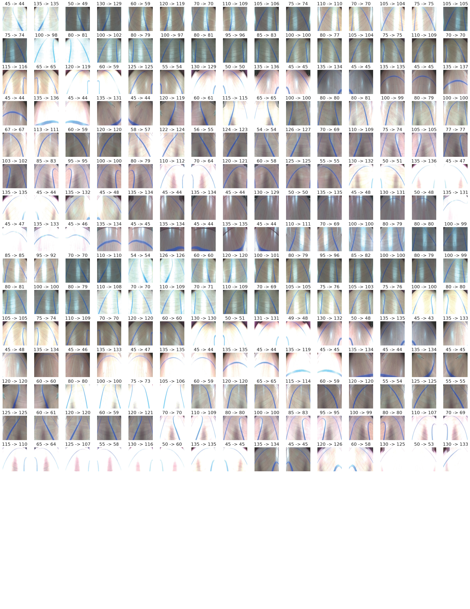

<details close>

<summary>

# Berechnung des Lenkwinkels

</summary>

<details close>

<summary>

## Umsetzungsschritte

</summary>

* Implementierung der Klasse ```CamCar``` zur Nutzung der Kamera
* Visualiserung des Kamerabildes über Dash
* Entwicklung der Klasse ```OpenCVCar```
    * Fahrspurverfolgung durch bildverarbeitende Methoden mit OpenCV
* Umsetzung einer Lenkwinkel-Berechnung

</details>

<details close>

<summary>

## Erkennung der blauen Fahrspur-Begrenzung

</summary>

```python
# Bild beschneiden
img_crop = img[150:350,:,:]

# Parkettfugen verwischen
img_blur = cv2.blur(img_crop,(9, 9))

# In HSV-Farbraum konvertieren
img_hsv = cv2.cvtColor(img_blur, cv2.COLOR_BGR2HSV)

# Limits der HSV-Filter setzen
lower_blue = np.array([self.lower_hue, self.lower_saturation, self.lower_value])
upper_blue = np.array([self.upper_hue, self.upper_saturation, self.upper_value])

# Maske errechnen
mask = cv2.inRange(img_hsv, lower_blue, upper_blue)

# auf der Maske Kanten erkennen
edges = cv2.Canny(mask, 50, 150, apertureSize=3)

# mit den Kanten gerade Linien erkennen
lines = cv2.HoughLinesP(edges, 1, np.pi / 180, threshold=30, minLineLength=30, maxLineGap=20)
```

</details>

<details close>

<summary>

## Verschiedene Modelle der Lenkwinkel-Berechnung

</summary>


* Ziel: Alle Gruppenmitglieder sollen eigenes Modell implementieren können
* Umschaltung in der Dash-App zur Laufzeit während der Fahrt
* Implementierung über ein Dictionary

```python
methodDictionary = {0: calc_steering_angle_0.calculate_steering_angle, 
                    1: calc_steering_angle_1.calculate_steering_angle, 
                    2: calc_steering_angle_2.calculate_steering_angle,
                    3: calc_steering_angle_3.calculate_steering_angle,
                    4: None, # used for avg calculation
                    5: calc_steering_angle_5.calculate_steering_angle,
                    6: calc_steering_angle_6.calculate_steering_angle,
                    7: calc_steering_angle_7.calculate_steering_angle}
...
method = methodDictionary[self._proc.calc_angle_method]
angle = method(line_filter, lines)
```

* zusätzlich wurde eine Lenkwinkel-Berechnung umgesetzt, die den Durchschnittswinkel aller implementierten Modelle nutzt und auch eine von CoPilot generierte Berechnung

</details>

<details close>

<summary>

## Algorithmus zur Lenkwinkelberechnung - Sebastian

</summary>

Mehrere Versuche scheiterten in der Praxis, am Ende folgende Umsetzung:

* Unterteilung in linke und rechte Linien anhand deren Steigung
* Erkennung der vertikal nähesten linken und rechten Linie
* Sind die Linien in vertikal zu weit voneinander entfernt, wird nur die nähere betrachtet
* Sind die Linien in horizontal zu weit voneinander entfernt, wird nur die nähere betrachtet
* Prüfung auf zu enge Kurven (Rückgabe eines negativen Lenkwinkels)
* Bei nur einer Linie:
    * Bestimmung des Lenkwinkels durch ArcTan der Liniensteigung
* Bei linker und rechter Linie:
    * Bestimmung der Schnittpunkte beider Linien mit der Grundlinie
    * Bestimmung des Lenkwinkels über Dreisatz anhand des Abstands des Mittelpunktes der Schnittpunkte zum Fahrzeugstand

</details>

<details close>

<summary>

## Algorithmus zur Lenkwinkelberechnung - Copilot

</summary>

* Detecting Lane Lines
    * Hough transform to detect line segments in the region of interest.

* Classifying Lane Lines
    * classify detected line segments into left and right lane lines based on their slope

* Averaging Lane Lines:
    * calculate average slope and intercept for the left and right lane lines
    
* Calculating Intersection Points
    * calculate the intersection points of the left and right lane lines with the bottom of the image
    
* Finding Midpoint
    * find the midpoint between the intersection points of the left and right lane lines. This midpoint represents the center of the lane.
 
* Calculating Steering Angle
    * calculate the angle between the vertical center of the image and the midpoint of the lane

* Adjust the Steering Angle
    * to fit within the range of 45 to 135 degrees, with 90 degrees being straight forward

</details>

<details close>
<summary>

##   Nutzung von MLFlow

</summary>

* MLflow ist eine Machine Learning Plattform Komponente
* MLflow begleitet den kompletten Machine Learning Prozess eines Data Science Projektes
* Ziel ist die Dokumentation, Reproduzierbarkeit und die Vereinfachung des Deployments


 


</details>

<details open>
<summary>

## Installation von MLFlow

</summary>

* Massive Probleme beim Starten des lokalen MLflow-Servers
* Installation unter WinPython scheiterte
* Inbetriebnahme einer virtuellen Python-Umgebung

```python
python -m venv .venv
.venv\scripts\activate   # Aktivierung der virtuellen Umgebung
.venv\scripts\deactivate # Deaktivierung der virtuellen Umgebung
```

* danach Installation der benötigten Python-Bibliotheken

```python
pip install numpy==1.26
pip install opencv-python
pip install tensorflow==2.8
pip install protobuf==3.20 # evtl. unnötig
pip install mlflow
```
* alle weiteren Bibliotheken sind von den o.g. abhängig und werden somit automatisch installiert

* danach war der Import der MLflow-Bibliotheken und der Start des lokalen Servers erfolgreich

```python
mlflow server --host 127.0.0.2 --port 8080
```


</details>


</details>


<details close>

<summary>

# Umsetzung der Neuronalen Netze

</summary>

<details close>

<summary>

## Datenlage

</summary>

* 200 bis 300 Aufnahmen von der Raspi-Kamera
* Manuelle Prüfung bzw. Korrektur des Lenkwinkels der Aufnahmen
* zusätzliche Spiegelung der Bilder: `img[:,::-1,:]`
* teilweise Cropping: `imgage[150:350,:,:]`
* verschiedene Bildgrößen (128, 128), (160, 160) bzw. (200, 200)
* Data Augmentation, vor allem bzgl. der Helligkeit
    * Weißes-Pixel-Problem
    * ```python
        datagen = ImageDataGenerator(
            shear_range=0.0,
            zoom_range=[1.0, 1.0],
            width_shift_range=[0, 0],
            height_shift_range=[0, 0],
            horizontal_flip=False,
            fill_mode='nearest',
            brightness_range=[0.2, 2.0]
        )
        ```

In Summe liegen somit 500 bis 2000 Bilder vor, um das neuronale Netz zu trainieren.


</details>

<details close>

<summary>

## Architektur

</summary>

Nach einigen Durchläufen hat sich diesen Netz als bestes herausgestellt:


```python
# nervous-rat-924 ff
model = Sequential([
    Input(shape=(images[0].shape)),
    Conv2D(32, (3, 3), activation='relu'),
    MaxPooling2D(pool_size=(2, 2)),
    Conv2D(64, (3, 3), activation='relu'),
    MaxPooling2D(pool_size=(2, 2)),
    Conv2D(128, (3, 3), activation='relu'),
    Flatten(),
    Dense(128, activation='relu'),
    Dense(1)
])
```
</details>

<details close>

<summary>

## Parameter des besten Netzes "aged-snail-344"

</summary>

| Parameter | Wert |
| --- | ----------- |
| Bilder Cam | 200 |
| gespiegelte Bilder | 200 |
| augmentierte Bilder | 2000 |
| Cropping | ja |
| Epochen | 100 |
| Lernrate | 0,01 |
| Bildgröße | (200, 200) |
| Lernrate | 0,01 |
| batch_size | 64 |
| Berechnungsdauer | 59.3min |

| Metrik | Wert |
| --- | ----------- |
| lr | 0.00001 |
| loss | 1.277 |
| mae | 0.748 |
| val_loss | 9.203 |
| val_mae | 1.661 |



</details>

</details>

<!--- ################################ -->
<!--- ################################ -->
<!--- ################################ -->

<details open>

<summary>

# Welche Probleme gab es bei den Umsetzungen (Frank)

---

</summary>

## Lichtverhältnisse
## unterschiedliche Böden
## Berechnungen der Lenkwinkel aus den drei Methoden
### Median von Frank stark abhängig von der erkannten Anzahl der Linien rechts und links bei einer Fahrbahn besser
### zu wenig blaues Klebeband (wünsche)
### zweites paar Akkus (wünsche)
## Bild richtig übergeben OpenCV (mit Linien gelernt aber ohne) 
## Verständnis zu den Modellen viel kopiert aber nicht vollständig durchdrungen (wunsch ggf. 2Tage )
## WinSCP für das Kopieren der Bilder hilfreich
## Git Fetch Git Pull, das gleichzeitige Arbeiten an Dateien diesmal besser weil stärker auf die Reiehnfolge geachtet und mehr zusammen programmiert
## Schrumpfende Gruppe externe Einflüsse 
## Erkenntnis ggf. im Front-End manuaelle Fahrt mit Bildspeicherung und dem dazugehörigen Lenkwinkel

---

</details>

<details open>

<summary>

# Beschreibung des HTML-Frontends (Tonspur, Life-Umschalten) (Frank-Screenshoot)

---

</summary>

<br>
---

</details>
yvxcy

<details open>

<summary>

# Ggf. Video von Fahrten (Frank ggf. Sebastian mit entschärfter Todeskurve)

---

</summary>

<br>

---

</details>


<details open>

<summary>

# Weiteres

</summary>


## Was kann man da durch die Lernprogramme alles sehen/ erkennen

---

</details>